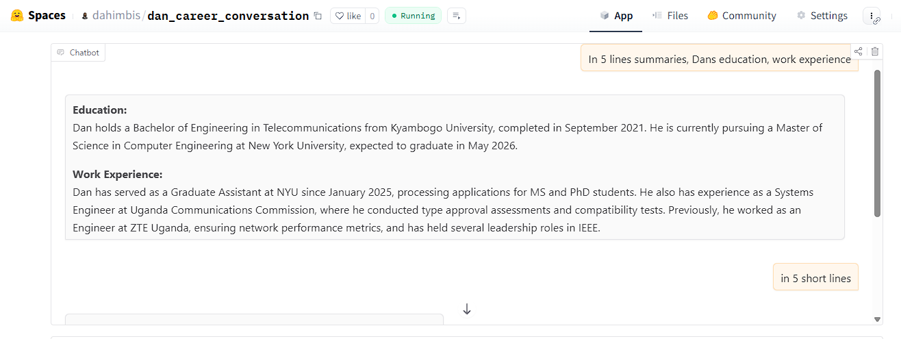

## Hi there 👋

  

---

### 🧠 About Me

I am **Dan Ahimbisibwe**, a Computer Engineering graduate student at **New York University (NYU)**. I started in telecommunications engineering in Uganda, but data and AI had other plans for me.

### ✨ What Excites Me

- 🤖 **Agentic AI:** Building AI agents that don't just answer questions, but take action too. 
- ⚡ **Automation:** If it's repetitive, it should be scripted 
- 🔧 **Data Engineering:** The unsung hero of every great ML project  
- 🤯 **Machine Learning, Deep Learning, LLMS and RL:** Helping machines learn without taking over the world (yet). AI for social good.

**Current Interests or Roles:**

- 🧠 **Machine Learning Engineer**
- 👾 **AI Agentic Engineer**
- 📊 **Data Engineer and Scientist**
- 🧪 **AI and ML Researcher**
- 💻 **Software Engineer**
- ⚙️ **MLOps Engineer**
- 📈 **Data Analyst**
- 🧾 **Business Analyst**
- ☁️ **Cloud and Big Data Developer**
- 🤖 **STEM Instructor**

**When I'm not coding or studying:**

I love working with students and children through STEM outreach programs. I am also currently writing research papers on STEM experiences, best practices, effectiveness of STEM outreach programs.
I am a Member of IEEE and enjoy volunteering for conferences, workshops, and community-engaging activities that have a positive impact on humanity.
I also enjoy exploring new places, regions, cities, and countries whenever possible, probably thinking about visiting Mars too.
Lastly, I am very passionate about AI in Education, Digital Health, and Public Administration.

**Chat with me**
## 💬 Chat With My Career Bot
Ask questions about my professional life, career, previous education, and any other relevant information.

---

### 🛠️ Technologies & Tools

**Languages & Frameworks**  

**Machine Learning & AI**  

**Agentic AI Tools**  

**Data & Visualization**  

**Cloud & DevOps**  

**Tools & IDEs**  

---

### 📈 GitHub Stats

  
  

---

### 📫 Connect with Me

--

### 👀 Visitor Count

## GitHub Profile Trophy 🏆

